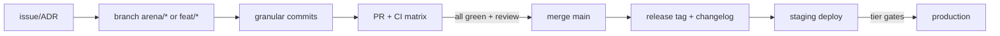

# Step 11 · Engineering Operating System

Author: Ramprasad · 2026-09-11 · Status: ACTIVE (this is how the team ships)

## 1. SDLC

- **Trunk-based** with short-lived branches; granular commits are a repo
  convention (no squashed mega-commits — judging/history discipline from
  the hackathon era, kept because archaeology matters).
- **CI is law**: `.github/workflows/ci.yml` gates every PR — contracts
  (forge build+test), agent (typecheck + 153 tests), service, frontend,
  gitleaks (full history). Zero-secrets rule: every job passes on a clean
  checkout with no `.env`.
- **Spec-first for contracts**: no contract change without a `docs/MANDATE.md`
  RFC and, at mainnet, an audit delta (`15-governance.md` §3).
- **ADR culture**: significant decisions land in
  `docs/architecture/01-system-architecture.md` §8 digest or a standalone
  ADR before code.

## 2. Definition of done (per PR)

1. CI matrix green; tests updated with the change.
2. Docs touched if behavior/docs could drift (the E2E tiers exist because
   docs↔code drift is this repo's historical bug class).
3. Zero new console errors (frontend), zero new gitleaks findings.
4. Evidence link for user-visible claims (tx hash / test run).

## 3. Environments & release

- `local` (run.sh) → `staging` (per-release contracts on Sepolia +
  containerized service/frontend) → `production` (post-audit mainnet only).
- Contracts are immutable artifacts: a "deploy" is a new audited deployment
  + address rotation documented in `frontend/lib/site.ts`,
  `agent/src/mandate.ts`, and `docs/architecture/README.md` — exactly as the
  v2 testnet redeploy was handled.
- Rollback: frontend/service roll back via prior image; contract "rollback"
  is by design impossible — hence audits, invariants, and the refund-first
  failure mode.

## 4. Observability & on-call

- Now: `/health` probe, structured logs, CI canary, mirror-node receipts.
- P1: metrics/traces/log shipping (one vendor, boring choice), uptime
  probes on staging + prod, onchain alerting (revocations, threshold
  changes, escrow anomalies) routed to the on-call rotation.
- On-call from post-seed (founder first); SEV taxonomy:
  - **SEV1**: fund-safety-relevant anomaly (release without validation
    event, unexpected admin action) — page, all-hands, public postmortem.
  - **SEV2**: paid API down / payments blocked — restore, refund-safety
    check, postmortem.
  - **SEV3**: degraded UX, stale cache — ticket.
- Postmortems published in-repo (blameless) — evidence culture applies
  internally too.

## 5. Code quality standards

- TypeScript strict across agent/service/frontend (`tsc --noEmit` gates).
- Solidity: 0.8.26, via-IR, OZ primitives, CEI, events on every state
  change, no proxies (immutables preferred per security review), NatSpec
  headers with `@author`.
- Tests are features: the E2E tier structure (TEST_INFRA.md) is maintained
  as product surface.
- Dependencies: lockfiles committed, Dependabot, patch-package for pinned
  vendor fixes (documented in repo).

## 6. Incident response runbook (summary)

1. Acknowledge (5 min), classify SEV, open channel + doc.
2. Contain (freeze deploys, revoke staging keys if secret-suspect).
3. Communicate (status page at P2; X/Discord meanwhile; never speculate).
4. Eradicate/recover (deploy fix; escrow-side incidents default to refund
   path — that's what it's for).
5. Postmortem within 5 business days; risk register updated
  (`14-risk-register.md`).
