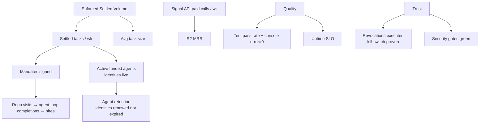

# Step 13 · Metrics, KPIs & OKRs

Author: Ramprasad · 2026-09-11 · Status: ACTIVE (ledger started below)

## 1. North star

**Enforced Settled Volume (ESV)** — dollars of task value settled through
varanasi escrows **with all gates passing** (released on proof or refunded
by design). Not gross volume, not signups: value that experienced the
enforcement guarantee.

Guard-rail metric: **Guarantee Integrity** — releases without a matching
validation event = 0, always. If this is ever non-zero, the north star is
void until postmortem closes.

## 2. KPI tree

## 3. Targets by phase

| Metric | Now (P0/P1) | Mainnet Q1 | Yr-1 base |
|---|---|---|---|
| ESV / quarter | testnet only (track tasks, not $) | $250K | $20M |
| Settled tasks / wk | ≥ 5 (testnet, real workloads) | 50 | 400 |
| Active agent identities | 2 | 50 | 300 |
| Signal API paid calls / wk | ~10 (testnet) | 500 | 5,000 |
| R2 MRR | $0 | $5K | $25K |
| Design partners | 0 → 3 LOIs | 3 active | 8 |
| Test pass rate | 100% (CI green rule) | 100% | 100% |
| Refund path exercised | each release | monthly drill | quarterly drill |
| Audit findings open > SLA | 0 | 0 | 0 |

## 4. Instrumentation rules

- Onchain metrics from events (authoritative) — indexer at P1; no
  client-side analytics on the escrow path.
- Funnel proxies without surveillance: testnet receipts + repo telemetry
  (clones/stars) + support signals; privacy stance in
  `docs/architecture/02-data-architecture.md`.
- Weekly snapshot appended below; quarterly investor update generated from
  it + `09-finance.md` actuals.

## 5. OKRs (current cycle, Q4 2026)

**O1 — Become mainnet-ready.** KR1: audits A1+A2 engaged & scoped. KR2:
multisig+timelock deployed and tested on Sepolia. KR3: invariant/fuzz suites
in CI. KR4: checklist `docs/architecture/03-security-architecture.md` §5
≥ 80% green.
**O2 — Validate demand.** KR1: 20 discovery interviews done, kill-criteria
evaluated. KR2: 3 design-partner LOIs. KR3: 100 testnet tasks with external
payers. KR4: onboarding funnel < 30 min clone→paid-signal for a stranger.
**O3 — Fund the company.** KR1: seed round covered (term sheet). KR2: grant
applications out. KR3: burn ≤ plan ±10%.

## 6. Ledger (append-only)

| Date | Settled tasks (cum.) | Agent identities | Paid signal calls | Tests | Notes |
|---|---|---|---|---|---|
| 2026-09-11 | 1+ released escrow (DEMO §7), 2 workers-hires (DEMO) | 2 live (`sentinel-1` + vUSD demo) | 2 (HashScan-linked) | 153 agent / 106 E2E t1–3 / CI green | P0 baseline recorded |
