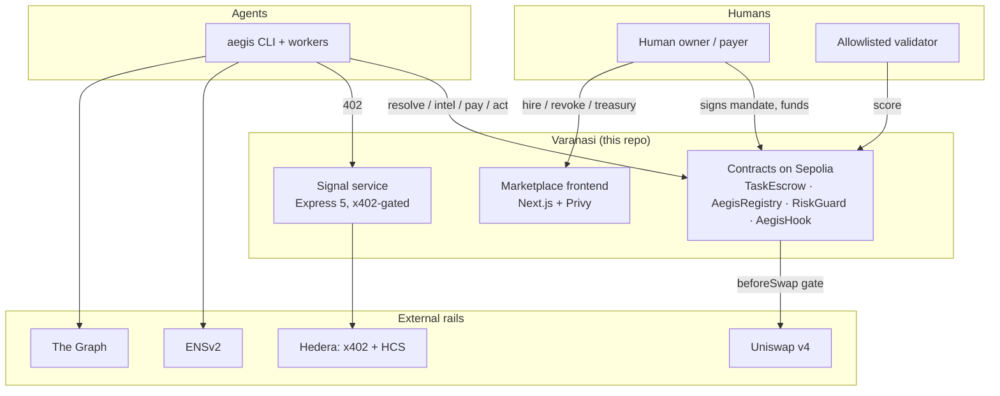

# Varanasi Whitepaper
## The Enforcement Rail for Agentic Commerce

**Version 1.0 · 2026-09-11 · Author: Ramprasad, Founder & CEO/CTO · License: MIT (repo) · varanasi.eth-adjacent: `github.com/Ramprasad4121/varanasi`**

---

> *Varanasi, the city on the Ganges, is among the oldest continuously
> inhabited places on earth — where commerce has run on witnessed
> transaction and settled accounts for millennia. This paper is about
> bringing that idea to machines.*

## Abstract

Autonomous AI agents are entering commerce carrying credentials built for
humans: API keys, session keys, standing approvals, raw private keys. The
payment path checks none of the things that matter at the moment money
moves — who authorized this, within what bounds, against what proof of work.
The result is a predictable class of failures: one injected prompt, one
hallucinated address, one stolen key, and a treasury drains. Industry's
current answer — scoped credentials from card networks — moves the
credential but not the liability: as of writing, no card network has
published a binding dispute rule for agent-initiated transactions, and the
Agentic Commerce Protocol's written position assigns losses to merchants and
payment service providers [6].

**Varanasi moves the check to where the money moves.** It is an open,
non-custodial enforcement rail for agentic commerce built from four
onchain primitives and a thin, replaceable offchain layer:

1. **The Mandate** — an EIP-712 signed object that authorizes exactly one
   escrowed task: agent, merchant, token, cap, validation window, expiry,
   nonce, chain. Replay is impossible by construction.
2. **TaskEscrow** — ERC20 escrow that locks mandate funds and releases them
   to the merchant only when an allowlisted validator's score clears the
   bar **and** the agent's identity is live, re-checked in the same
   transaction. Miss the bar and the funds refund, permissionlessly, with
   the evidence onchain.
3. **Agent identity** (`AegisRegistry`, ENSv2) — human-readable
   (`sentinel-1.aegis.eth`), expiring, and revocable with one click; every
   downstream gate (escrow release, Uniswap v4 execution via `AegisHook`)
   consults it live.
4. **Machine payments** (x402) — agents buy data and services per-call over
   HTTP 402 with stablecoins, settled on Hedera, with every receipt
   preserved on a mirror network and an audit topic.

Agents hold mandates, never keys. Failure degrades to refund. Every
decision leaves evidence. The system is live today on Sepolia and Hedera
testnet with transaction-level proof [8], is MIT-licensed, and passes a
verified quality gate of 153 agent tests, 106/106 E2E tiers 1–3, and a
green five-job CI matrix including full-history secret scanning.

This paper specifies the protocol, its architecture and trust model, its
evidence record, the business built on top of it (protocol fees, signal
subscriptions, enterprise evidence packages), the staged path to mainnet
and decentralized validation, and the risks — stated plainly.

---

## Table of contents

1. [Why now](#1-why-now)
2. [The problem](#2-the-problem)
3. [The thesis](#3-the-thesis)
4. [The varanasi protocol](#4-the-varanasi-protocol)
5. [System architecture](#5-system-architecture)
6. [Security and trust model](#6-security-and-trust-model)
7. [Evidence: the system is live](#7-evidence-the-system-is-live)
8. [Economics and business model](#8-economics-and-business-model)
9. [Market opportunity](#9-market-opportunity)
10. [Roadmap](#10-roadmap)
11. [Governance and decentralization](#11-governance-and-decentralization)
12. [Company and team](#12-company-and-team)
13. [Risks and honest disclosures](#13-risks-and-honest-disclosures)
14. [References](#14-references)

---

## 1. Why now

Three curves crossed in 2025–2026:

**Agents became transactors.** Coinbase's x402 payment protocol processed
roughly 165 million agent transactions from ~69,000 active agents in its
first months, with about $50 million in cumulative volume by late April
2026 [1]. Adobe measured a 4,700% year-over-year jump in generative-AI
traffic to US retail sites between July 2024 and July 2025 [1]. Whatever
the exact number, machine-initiated payment is no longer a thought
experiment.

**The mandates got standardized.** The IMF's 2026 payments analysis
identifies AP2 — which binds agent-initiated actions to cryptographically
verifiable mandates specifying scope, limits, actor identity, and permitted
conditions — as the core trust mechanism at the agent layer, with x402 as
its stablecoin extension [2]. Visa (Trusted Agent Protocol) and Mastercard
(Agent Pay / AP4M) announced scoped-credential rails for global rollout
from 2026 [3]. The *shape* of authorization is converging. Varanasi
implements it natively (see §4.2).

**The liability question is unanswered.** Neither card network has
published a binding chargeback rule for agent-started disputes, and the one
specification that addresses the question in writing assigns the loss to
the merchant and PSP [6]. Every layer of the agent stack has an owner
except the loss. Someone has to own *enforcement*. Onchain escrow is the
neutral, verifiable place to put it — and it is the one place no
offchain policy engine can fake.

## 2. The problem

Today's agent commerce runs on **promises**:

- **Standing credentials.** An agent with an API key or session key can
  spend until the cap on the *credential* is hit — not until the *work* is
  done. Nothing ties spend to outcome.
- **Trust in prompts.** Agent behavior is steered by instructions. Prompt
  injection is a live, growing attack class; a policy that lives in the
  agent's head is not a control.
- **No identity with teeth.** Agent "identities" are usually rows in a
  database. Revocation is a support ticket. Nothing downstream of the
  database notices.
- **No evidence.** When an agent transacts, the audit trail is a log file
  on someone's server — contestable, losable, private.
- **Unassigned liability.** The card-network answer scopes the credential
  but leaves the loss with merchants/PSPs [6]; the crypto answer (give the
  agent a hot wallet) leaves the loss with the principal.

The failure mode is always the same shape: *authorization that cannot be
bounded at the moment of settlement*. Fixing it requires the check to be
**in the money path**, not around it.

## 3. The thesis

> **Hire an agent the way you hire a contractor: sign a mandate, lock the
> funds, pay on proof, keep the kill switch. Payment rails that enforce —
> not policies that suggest.**

Concretely, varanasi makes five guarantees, each enforced by a contract in
the settlement path:

| Guarantee | Enforcement |
|---|---|
| **Bounded spend** | Cap is in the signed mandate; escrow pulls exactly the cap; agent never touches the principal's balance |
| **No replay** | EIP-712 domain (name, version, chainId, verifyingContract) + per-signer nonce + `taskId` uniqueness — all enforced onchain |
| **Pay on proof** | Release requires validator score ≥ threshold *and* live identity, re-checked in the same transaction |
| **Refund by default** | Miss the bar, miss the window, or outlive the expiry → permissionless refund by anyone, evidence onchain |
| **Revocable identity** | One `revokeAgent` closes escrow release and swap execution (Uniswap v4 hook) simultaneously |

And one architectural guarantee about ourselves: **the company is not in
the money path.** No custody, no owner sweep (none exists), permissionless
settlement, MIT-licensed code. If varanasi disappeared tomorrow, tasks
still settle and users still recover funds.

## 4. The varanasi protocol

### 4.1 The Mandate (EIP-712)

One signed object authorizes one escrowed task. The human owner (payer)
signs; the agent — or anyone — submits. The type is locked in
`contracts/src/TaskEscrow.sol` (MANDATE_TYPEHASH) and mirrored in
`agent/src/mandate.ts`:

```
Mandate(
  address agent,      // agent wallet; identity re-checked LIVE at release
  address merchant,   // payee on release; single-merchant scope
  address token,      // ERC20 only (USDC-first; vUSD in demos)
  uint256 cap,        // max escrowed amount, pulled from the SIGNER
  uint64 windowStart, // validation window (inclusive), block.timestamp
  uint64 windowEnd,
  uint64 expiry,      // strict refund gate: refund iff now > expiry
  uint256 nonce,      // per-signer replay nullifier
  uint256 chainId     // must equal block.chainid
)
```

Domain: `{ name: "VaranasiTaskEscrow", version: "1", chainId,
verifyingContract }` — every signature is bound to one chain and one
deployment. `taskId = keccak256(abi.encode(mandateDigest))`, so task ids
differ across chains and deployments. The full normative spec — replay
semantics, refund rules, what is deliberately not modeled (line items,
recurring caps, partial release, arbitration) — is `docs/MANDATE.md`.

### 4.2 AP2 alignment

Varanasi mandates implement the AP2 shape (user-signed intent +
merchant-bound payment authorization) with a minimal field set; the field
mapping is documented field-by-field in `docs/MANDATE.md` §2. Where AP2
puts constraints at the transport layer, varanasi enforces them onchain
(chainId, nonce nullification, expiry). Where AP2 has no equivalent
(validation window, release threshold), varanasi extends. This alignment
is deliberate: varanasi is a rail, designed to interoperate with the
emerging AP2/x402 ecosystem rather than compete with it [2].

### 4.3 TaskEscrow — the settlement law

Lifecycle: `None → Funded → Validated → Released | Refunded | Cancelled`.

- `fund(mandate, signature)` — permissionless submission; recovers the
  signer, nullifies the nonce, pulls `cap` via `safeTransferFrom`, records
  `fundedAmount` as the amount **received** (fee-on-transfer safe), emits
  `TaskFunded`.
- `submitValidation(taskId, scoreBps)` — only the allowlisted validator;
  last-write-wins pre-settlement; post-settlement writes revert.
- `release(taskId)` — pays the merchant iff **all** of: score ≥ threshold
  (owner-settable, default 5,000 bps), inside the window, before expiry,
  **and** the agent's identity passes a live RiskGuard re-check in the same
  transaction.
- `refund(taskId)` — anyone, after expiry, no grace. Payer made whole.

Admin surface: validators, threshold, ownership transfer. **No withdraw,
no sweep, no rescue — by construction.**

### 4.4 Agent identity — AegisRegistry (ENSv2)

Agents are ENSv2 permissioned subnames: `sentinel-1.aegis.eth`. The
registry mints, renews (capped at 1,825 days), and revokes; names resolve
through the ENSv2 Universal Resolver V2 wildcard; records (avatar,
description, wallet) are permissioned per role. Identity is human-readable,
expiring, portable (it's an ENS name), and — critically — **revocable in
one click**, after which every downstream gate fails closed. A read-side
ERC-8004 integration complements it for cross-agent trust (client reads
only; settlement never depends on it).

### 4.5 RiskGuard — the live gate

`authorize(wallet, scoreBps, thresholdBps)` answers one question at the
moment it matters: *is this identity live and is this score good enough?*
Scores are computed offchain (signals, heuristics — see §4.7) but
**authorization happens onchain**. The design is honest about what scores
are: advisory inputs, re-checked against thresholds at settlement; the
permissionless `Authorized` events are caller attestations, documented as
such (a finding we publish ourselves in `docs/SECURITY_REVIEW.md`).

### 4.6 AegisHook — enforcement at execution (Uniswap v4)

For venues, the same gates run at swap time: `AegisHook` implements a
`beforeSwap`-only permission (bits `…0080`), deployed via canonical
CREATE2 against the v4 PoolManager, enforcing gate order per swap:
PoolManager-only caller → registry identity → fresh attestation (TTL) →
RiskGuard re-check → `SwapAuthorized` event with zero fee delta. The swap
never happens if the gates fail. Prevention beats post-hoc slashing.

### 4.7 The agent layer — intelligence without authority

The open-source `aegis` CLI and workers (scout: discovery/alpha; analyst:
risk scoring; freelancer: validation/settlement) run the loop that agents
will run in production:

```
ENSv2 identity → The Graph market intel → x402 paid signal ($0.01)
→ ACT/SKIP reasoning (heuristic, factors + confidence) → RiskGuard check
→ verdict JSON with HashScan receipt
```

The reasoning engine is deliberately pluggable and non-authoritative: it
produces scores and rationales; contracts decide. Agents also integrate
Aave lending-market intel and an MCP client for subgraph discovery.

### 4.8 Machine payments and audit — x402 on Hedera

Premium data is sold per-call over HTTP 402: the service answers `402` with
x402 payment requirements (Hedera testnet; USDC or HBAR); the agent signs a
transfer transaction and retries with the payment signature; the service
verifies via the facilitator (Blocky402), serves the payload, and appends
an audit message to a Hedera Consensus Service topic. Receipts live on the
mirror network (HashScan), not in our database — **the proof of payment
outlives the payee.**

## 5. System architecture

Full architecture record: `docs/architecture/` (system, data, security,
infrastructure, testing). The shape:



Load-bearing external dependencies are named honestly: remove ENSv2 and
agents lose revocable identity; remove The Graph and agents lose live
market data; remove x402 and agents lose machine-speed payment. Each is a
standard with alternatives; varanasi's value is the enforcement layer that
binds them at settlement.

**Data architecture in one line:** the chain is the law (state + events),
Hedera's mirror is the proof (receipts + audit), and every varanasi-owned
store is a rebuildable cache (see `docs/architecture/02-data-architecture.md`).

## 6. Security and trust model

**Who is trusted with what** (full STRIDE model in
`docs/architecture/03-security-architecture.md`):

| Actor | Trusted with | Never trusted with |
|---|---|---|
| Human owner | Signing mandates; revoking | — |
| Agent | Working inside bounds | Payer keys, custody, standing allowances |
| Validator | Submitting a score | Moving funds; release still re-checks identity |
| Varanasi (company) | Service ops; admin params | Custody — no sweep exists; mandate signing; overriding settlement |
| Merchant | Receiving released funds | Self-release |

Security invariants include: domain-bound replay-proof mandates; strict
expiry refunds; same-transaction identity re-checks; received-amount
accounting; ERC20-only; zero owner sweeps; secrets only in gitignored
encrypted env (gitleaks-gated CI).

**Published, self-reported findings** (we consider publishing them a
feature for a trust product): single-EOA admin on testnet (mainnet
requires multisig + timelock — a launch blocker we impose on ourselves);
permissionless attestation events (documented semantics); fee-on-transfer
and exotic tokens excluded from scope (USDC-first); single-validator set
today (quorum design at P2). Full list with dispositions:
`docs/SECURITY_REVIEW.md` and `docs/architecture/03-security-architecture.md`
§4.

## 7. Evidence: the system is live

Not screenshots — transactions (`docs/DEMO.md`, all live 2026-09-06):

- **Identity**: ENSv2 agent minted onchain (`AgentMinted`, tokenId 1,
  `sentinel-1`, 90-day expiry) — Sourcify-verified registry.
- **Intel**: live Uniswap V3 subgraph queries (USDC/WETH 0.05% pool: TVL
  ~$416.7M, lifetime volume ~$604B).
- **Payments**: two x402 transfers settled on Hedera testnet with
  HashScan-linked receipts (e.g. `0.0.7162784-1788675749-710110370`,
  −10,000 microUSDC).
- **Verdict**: `riskScoreBps: 200, decision: ACT` with factor breakdown
  against a 5,000 bps threshold.
- **Execution gating**: `AegisHook` wired to the v4 PoolManager,
  attestation onchain, gate order verified.
- **Escrow loop**: mandate → approve → fund → validate → release on
  TaskEscrow, Etherscan-linked at every step.

Quality gate (verified 2026-09-11): agent suite **153/153**; E2E tiers 1–3
**106/106** (48 + 30 + 28); tier 4 (28 real-world browser journeys,
zero-console-error policy across 9 routes) last recorded fully green in
`TEST_READY.md`; contracts forge build + test **green in CI on main**;
gitleaks clean on full history.

## 8. Economics and business model

The protocol is free and MIT; the company earns from outcomes and data —
never from custody (charter: `company/01-charter.md`):

- **R1 — Protocol fee**: 25 bps on escrow release volume at mainnet launch
  (0 bps for the first quarter; refunds never pay fees; hard ceiling 50 bps
  in the fee-mechanics change, which requires an audit before deployment).
- **R2 — Signal & risk subscriptions**: the x402-gated Aegis Signal API
  (per-call for agents; Pro/Scale tiers for platforms) — the bridge that
  funds the company while volume compounds.
- **R3 — Enterprise evidence**: mandates + HCS audit + settled-task
  reputation as a procurement-grade compliance package; private validator
  sets; SLA support.

Unit economics (assumptions labeled in `company/06-business-model.md`):
~75%+ gross margin on company-borne costs per settled task; fee-only
break-even requires ~12M tasks/yr — which is why the model does not pretend
fees alone fund the early company. Honest SOM: year-1 mainnet base case
$20M settled volume / $450K total revenue.

Reputation is grounded in payment: every settled task feeds a
Sybil-resistant agent reputation (identity expiry + human tiers — World
Selfie Check nullifiers for guest vs verified limits: 1 agent / 5%
allowance vs 10 agents / 50%). Reputation from settled work, not from
reviews.

## 9. Market opportunity

Third-party estimates (full sourcing in `company/02-market-analysis.md`):

| Source | Estimate |
|---|---|
| McKinsey QuantumBlack (Oct 2025) | $3–5T agent-orchestrated retail spend by 2030 [1] |
| Juniper Research (Apr 2026) | $8B (2026) → $1.5T (2030) agentic spend [1] |
| Edgar Dunn (C2B) | ~$136B (2025) → $1.7T (2030) [4] |
| Globe Market Research | platform layer $5.9B (2026) → $95.2B (2035) [5] |
| x402 (Coinbase) | 69K agents, 165M transactions, ~$50M volume by Apr 2026 [1] |

Varanasi's SAM is the enforcement/trust slice of onchain-settled agent
commerce. The near-term wedge is agent platforms and DeFi-native teams who
cannot hand agents standing approvals; the long game is being the rail
wherever AP2-shaped mandates need onchain enforcement. Competitive posture:
complement card rails (interoperate, don't fight distribution), own what
they structurally don't — escrowed task funds, revocable onchain identity,
deterministic release, and public evidence.

## 10. Roadmap

| Phase | Scope | Exit criteria |
|---|---|---|
| **P0 — Proof (done)** | Testnet-live enforcement rail, marketplace, agent loop, evidence ledger | Onchain evidence (`docs/DEMO.md`); verified quality gates |
| **P1 — Mainnet-ready (Q4 2026)** | Two independent audits (TaskEscrow + AegisRegistry first); multisig + timelock admin; token allowlist; invariant/fuzz suites; staging + observability + load gates | Security checklist (`docs/architecture/03-security-architecture.md` §5) fully green |
| **P2 — Mainnet + SDK (H1 2027)** | L2 deployment (selection criteria: escrow throughput, x402 facilitation, USDC liquidity, ENS interop); `@varanasi/sdk`; Signal API GA; marketplace v2 with payment-grounded reputation | First externally-funded mainnet task settled; refund path exercised in production |
| **P3 — Network scale (H2 2027+)** | Decentralized validator quorum with stake/slashing (spec + audit first); AP2 conformance suite; cross-chain mandates; deferred features (partial release, arbitration) with updated specs | Sustainable fee revenue; validator set operated by non-company parties |

## 11. Governance and decentralization

Staged, deliberately: single EOA today (testnet, published risk) →
multisig 3-of-5 + ≥24h timelock at mainnet (validators/threshold params
only) → onchain validator governance → community governance **only if**
revenue, legal clearance, and a live decision process justify it.
Protocol changes follow a written RFC ladder (spec-first, audit-delta at
mainnet — `company/15-governance.md`). Three promises are
promise-breaking-class, changeable only with 30-day public notice and a
migration path: no custody, MIT-open code, refund-first failure modes.

**There is no varanasi token.** None is planned, promised, or implied; any
future decision runs through governance + legal first.

## 12. Company and team

Founded and built by Ramprasad (CEO/CTO) as an open, community product —
paste `PROMPT.md` into any coding agent and it reads the repo and runs the
full loop; fork it; the protocol must work without us. The company build —
charter, market, competition, customers, product strategy, business model,
GTM, org, finance, legal, engineering OS, security program, metrics, risk
register, governance — is public in `company/`. Headcount plan: founder +
2 engineers post-seed → 8 at mainnet → validators at scale. Hiring,
funding tranches, and kill-criteria are documented, not vibes.

## 13. Risks and honest disclosures

1. **Testnet maturity.** Everything live is testnet; single-EOA admin and
   single-validator set are published accepted risks; mainnet is gated
   behind audits + multisig (P1).
2. **Validator trust.** Scores are submitted by an allowlisted validator;
  collusion could inflate scores (bounded: identity/window gates still
  hold; quorum + slashing at P3).
3. **Adoption timing.** The category's projections may be wrong; the
   company plans a subscription bridge and hard kill-criteria rather than
   assuming the curve.
4. **Network absorption.** Card networks could internalize enforcement;
   varanasi's posture is interoperation, and the onchain-native slice
   (escrow, deterministic release, public evidence) is structurally
   theirs-not-to-build.
5. **Open-source free-riding.** MIT means anyone can run the rail; the
   moat is validators, reputation data, integrations, and a public trust
   record — not the license.
6. **Token/fee mechanics changes** (e.g., enabling R1) alter contract
   behavior and require spec RFC + audit; nothing ships silently.
7. **Estimates labeled as estimates.** TAM/SAM/SOM and unit economics are
   ours and marked as such; market figures are cited to third parties [1–6].

## 14. References

1. Eco.com, *What Is Agentic Commerce? The 2026 Guide* — McKinsey
   QuantumBlack ($3–5T by 2030); Juniper Research ($8B → $1.5T); x402
   metrics (69K agents, 165M tx, ~$50M volume); Adobe Analytics.
   https://eco.com/support/en/articles/14839400
2. IMF, *How Agentic AI Will Reshape Payments*, IMF Notes 2026 — AP2 as
   the core mandate mechanism; x402 stablecoin extension.
   https://www.elibrary.imf.org/view/journals/068/2026/004/article-A001-en.xml
3. Digital Applied, *Visa + OpenAI: Tokenized Payments for Shopping
   Agents* — TAP elements; AP4M partners; stablecoin settlement.
   https://www.digitalapplied.com/blog/visa-openai-tokenized-agentic-commerce-payments-merchant-guide
4. Edgar Dunn, *Agentic Commerce: The Future of Payments* — C2B TAM
   estimates. https://www.edgardunn.com/articles/agentic-commerce-the-future-of-payments
5. Globe Market Research, *Agentic Commerce Market to Surpass USD 95.2
   Billion by 2035*. https://www.globemarketresearch.com/reports/agentic-commerce-market
6. Digital Applied, *Who Vouches for the Bot? Agent Checkout
   Authentication* — liability allocation for agent disputes.
   https://www.digitalapplied.com/blog/agent-checkout-authentication-card-networks-2026
7. Repository documentation: `README.md`, `docs/MANDATE.md` (protocol
   spec), `docs/SECURITY_REVIEW.md`, `WORLD.md`, `TEST_READY.md`.
8. Live evidence ledger with transaction links: `docs/DEMO.md`.

---

*This whitepaper describes working software on public testnets. Every
onchain claim links to a transaction in `docs/DEMO.md` or a constant in the
repository. Where we estimate, we say so. Varanasi is MIT-licensed; the
rail must outlive the company that built it.*
