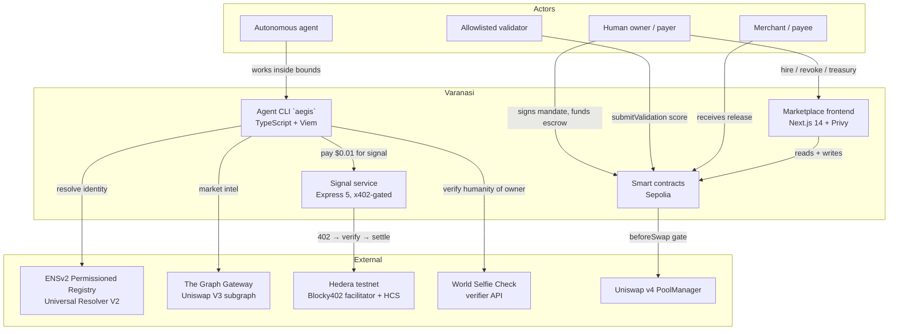
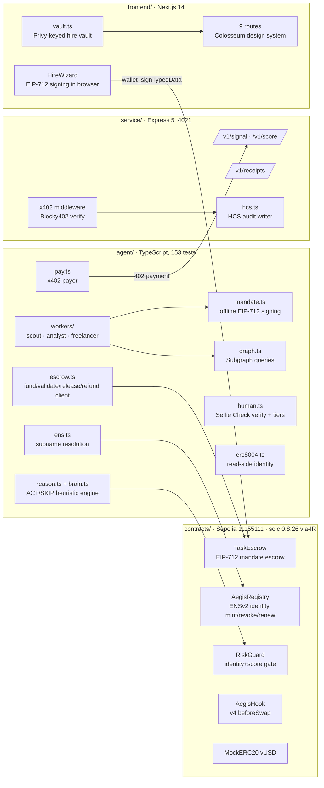
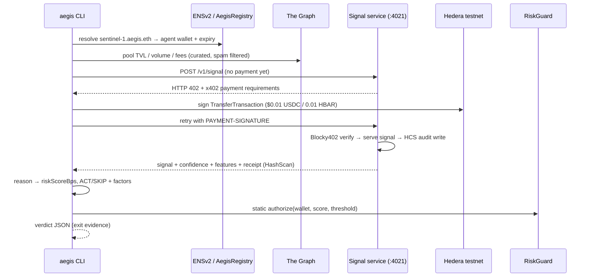

# 01 · System Architecture — varanasi

Author: Ramprasad · 2026-09-11

## 1. Design goal

Varanasi is an **enforcement rail for agentic commerce**: a set of contracts,
services, and clients that together guarantee *the check happens where the
money moves*. The architecture exists to make one property true and provable:

> An autonomous agent can earn and spend inside cryptographically signed,
> human-authorized bounds — and **cannot** exceed them, replay them, or outlive
> them — without the agent ever holding the human's keys.

Everything else (marketplace UX, signal APIs, analytics) is downstream of that
property.

## 2. Architectural principles

| # | Principle | Consequence in the codebase |
|---|-----------|------------------------------|
| P1 | **Enforcement at settlement, not in prompts** | All spend gates (`TaskEscrow`, `RiskGuard`, `AegisHook`) are onchain checks inside the money path; agent reasoning is advisory only. |
| P2 | **Agents hold mandates, never keys** | The human signs an EIP-712 mandate (cap, window, expiry, nonce); the agent never possesses a credential that can move funds ad libitum. |
| P3 | **Fail closed** | Missing identity, expired identity, stale attestation, low score, wrong chain, spent nonce → revert/refund. `tierFor()` in `agent/src/human.ts` returns `guest` on any doubt. |
| P4 | **Permissionless liveness** | `refund` and validation submission are open; settlement does not depend on the company's servers being up. |
| P5 | **Minimal admin surface** | No owner sweep exists by construction; admin can only manage validators, threshold, and ownership (`docs/MANDATE.md` §3). |
| P6 | **Evidence over screenshots** | Every state change emits an event; every payment has a mirror-node/HashScan receipt; audits go to Hedera Consensus Service. |
| P7 | **Standards leverage** | EIP-712 for mandates, ENSv2 for identity, ERC-8004 read-side for cross-agent trust, AP2-shaped semantics (see `docs/MANDATE.md` §2), x402 for machine payments, Uniswap v4 hooks for execution gating. |

## 3. System context (C4 level 1)



## 4. Containers (C4 level 2)



## 5. The two load-bearing flows

### 5.1 Hire flow (human → escrow → settlement)

```mermaid
sequenceDiagram
    participant H as Human (payer)
    participant FE as Frontend (HireWizard)
    participant TE as TaskEscrow (Sepolia)
    participant AG as Agent
    participant V as Validator
    participant RG as RiskGuard

    H->>FE: pick agent, cap, window, expiry
    FE->>H: EIP-712 Mandate to sign (9 fields)
    H->>FE: signature (keys never leave wallet)
    AG->>TE: fund(mandate, sig) — anyone may submit
    TE->>TE: recover signer; nullify nonce; pull cap via safeTransferFrom
    TE-->>TE: TaskFunded (state=1, fundedAmount = received)
    AG->>AG: work inside bounds (intel via Graph, alpha via x402)
    V->>TE: submitValidation(taskId, scoreBps)
    TE-->>TE: ValidationSubmitted (state=2)
    AG->>TE: release(taskId)
    TE->>RG: identity live? not revoked/expired?
    TE->>RG: score >= threshold (5000 bps default)?
    alt gates pass and inside window
        TE->>TE: TaskReleased (state=3) — ERC20 to merchant
    else miss bar or window expires
        TE->>TE: TaskRefunded (state=4) — anyone may call refund after expiry
    end
```

Key invariants (spec: `docs/MANDATE.md`):
- `taskId = keccak256(abi.encode(mandateDigest))` — domain-bound, differs
  across chains/deployments.
- `chainId` must equal `block.chainid`; per-signer `nonce` is nullified on use;
  existing `taskId` reverts (`TaskExists`) — defense in depth.
- `expiry` is a strict refund gate with no grace; `release` also dies past
  expiry (`WindowExpired`).
- Accounting uses **amount received** (fee-on-transfer safe).

### 5.2 Agent intelligence loop (identity → data → paid signal → verdict)



## 6. Component responsibilities & ownership

| Component | Responsibility | Owner (see `company/08-org-design.md`) |
|---|---|---|
| `contracts/src/TaskEscrow.sol` | Escrow lifecycle, EIP-712 recovery, replay defense, release gates | Protocol eng |
| `contracts/src/AegisRegistry.sol` | ENSv2 subname mint/revoke/renew, expiry, label rules | Protocol eng |
| `contracts/src/RiskGuard.sol` | `authorize(wallet, score, threshold)` — identity + score gate | Protocol eng |
| `contracts/src/AegisHook.sol` | v4 `beforeSwap` enforcement (identity → attestation → gate) | Protocol eng |
| `agent/src/mandate.ts` | Offline signing; locked domain `VaranasiTaskEscrow` v1 | Agent platform |
| `agent/src/{ens,graph,pay,reason,brain}.ts` | Identity, intel, x402 payment, reasoning | Agent platform |
| `agent/src/workers/*` | Demo workers: scout (discovery/alpha), analyst (scoring), freelancer (validation/settlement) | Agent platform |
| `service/src/*` | x402-gated API, receipts, HCS audit | Backend |
| `frontend/*` | Marketplace, hire wizard, vault, treasury | Product eng |
| `e2e/*` | Tiers 1–5 test harness, zero-console-error policy | QA/eng |

## 7. Interface contracts

Machine-readable references (kept authoritative elsewhere; summarized here):

- **HTTP**: `bazantic/openapi-signal.yaml` (signal service OpenAPI);
  base URL `http://localhost:4021` via `NEXT_PUBLIC_SIGNAL_URL`.
- **Onchain ABI**: 14-field `tasks(bytes32)` tuple (payer, agent, merchant,
  token, cap, fundedAmount, windowStart, windowEnd, expiry, scoreBps,
  validator, pinnedThresholdBps, pinnedValidator, state) — mirrored in
  `agent/src/escrow.ts` and `frontend/components/HireWizard.tsx`.
- **EIP-712**: domain `{name: "VaranasiTaskEscrow", version: "1", chainId,
  verifyingContract}`; 9-field Mandate type string (locked in
  `contracts/src/TaskEscrow.sol` MANDATE_TYPEHASH and `agent/src/mandate.ts`).
- **Events** (authoritative receipts): `TaskFunded`, `ValidationSubmitted`,
  `TaskReleased`, `TaskRefunded`, `TaskCancelled`, `AgentMinted`, `SwapAuthorized`.

## 8. Key architectural decisions (ADR digest)

| Decision | Choice | Alternatives rejected | Why |
|---|---|---|---|
| Where to enforce | Onchain, in the settlement path | Offchain policy engine, MPC wallets | P1: an offchain check is a suggestion; an onchain check is a law. |
| Credential shape | EIP-712 signed mandate (9 fields) | Session keys, standing approvals | Bounded by construction: cap/window/expiry/nonce are in the signed object; replay impossible. |
| Identity | ENSv2 permissioned subnames (`*.aegis.eth`) + ERC-8004 read-side | Custom registry only, OAuth-style agent IDs | Human-readable, revocable, expiring, standards-native; one-click revoke closes every downstream gate. |
| Payments | x402 (HTTP 402 → crypto payment) | API keys, subscriptions | Machine-native, per-call, no signup; matches agentic commerce direction (AP2 + x402 extension). |
| Execution gating | Uniswap v4 `beforeSwap` hook | Post-hoc slashing, watchtowers | Prevention beats punishment; the swap never happens if gates fail. |
| Settlement asset | ERC20 only, USDC-first | Native ETH path | Single well-audited path; no ETH special-casing in accounting. |
| Compiler | solc 0.8.26, `via_ir = true` | legacy codegen | v2 hardening grew `fund()` past legacy stack limits; via-IR keeps semantics identical (`contracts/foundry.toml`). |
| Data durability | Onchain events + Hedera mirror node as proof of record | Company database as source of truth | P4/P6: the company can disappear; the receipts cannot. |

## 9. Extension points (deliberately deferred)

Documented in `docs/MANDATE.md` §2 as out of scope for the current deployment:
line items / cart hash, recurring caps, multi-merchant allowlists, partial
release (all-or-nothing today), dispute arbitration beyond refund-after-expiry,
cross-chain mandate replay (chainId binding is strict). Each has a sketched
path in the roadmap (`company/05-product-strategy.md`).
