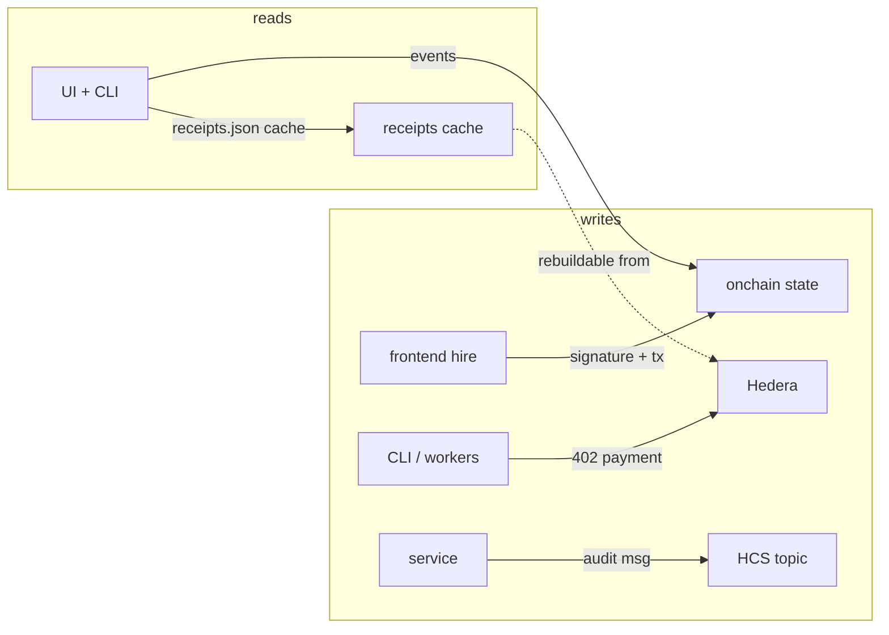

# 02 · Data Architecture — varanasi

Author: Ramprasad · 2026-09-11

## 1. Data philosophy

Varanasi is **non-custodial and evidence-first**. The company stores the
minimum required to operate; the chain stores the truth; Hedera's mirror
network stores the proof of payment. No database in this system is load-bearing
for fund safety — by design.

Tiering:

| Tier | Store | Authoritative for | Durability |
|---|---|---|---|
| 0 — Law | Ethereum (Sepolia today) contract storage + events | Task lifecycle, nonces, identity state, scores, thresholds | Chain |
| 1 — Proof | Hedera mirror node (HashScan) + HCS audit topic | x402 payment receipts, signal/score audit trail | Mirror network + topic history |
| 2 — Operating | `service/data/receipts.json` (last 100) | Fast receipt listing for UI | Rebuildable from Tier 1 |
| 3 — User | Browser vault (`frontend/lib/vault.ts`) + Privy identity | Hire history per account, agent listings | User-owned; follows Privy identity, guest copy is browser-local |
| 4 — Ephemeral | Agent CLI stdout / verdict JSON | Human-in-the-loop evidence | Session |

## 2. Onchain state model (Tier 0)

`TaskEscrow` per-task record (14 fields, `tasks(bytes32)`):

```
payer, agent, merchant, token, cap, fundedAmount,
windowStart, windowEnd, expiry, scoreBps,
validator, pinnedThresholdBps, pinnedValidator, state
```

- `State`: `0 None → 1 Funded → 2 Validated → 3 Released | 4 Refunded | 5 Cancelled`
- Replay protection: `usedNonce[signer][nonce]`.
- Events (`TaskFunded`, `ValidationSubmitted`, `TaskReleased`, `TaskRefunded`,
  `TaskCancelled`) are the authoritative receipt stream; the service indexes
  them read-only (never writes).
- `AegisRegistry`: agent subname → wallet, expiry, revoked flag
  (`AgentMinted`/`AgentRevoked`/`AgentRenewed` events).
- `AegisHook`: per-agent risk attestation (`agentRisk`, 30-day TTL in demo).

## 3. Payment & audit data (Tier 1)

- x402 receipts: Hedera transaction IDs, amounts, payer/payee accounts, and
  HashScan links — durable on the mirror node. Example live receipts in
  `docs/DEMO.md` §3 (`0.0.7162784-1788675749-710110370`,
  `0.0.7162784-1788676249-125024441`).
- HCS topic (`HCS_TOPIC_ID`): append-only audit messages for every paid signal
  and score. HCS gives consensus timestamps and ordered history — the audit
  log survives even if the service does not.

## 4. Operating data (Tier 2) and its replacement path

Current: `service/data/receipts.json`, capped at last 100, no PII beyond
addresses and query strings. This is a deliberate hackathon-scale choice.

Production plan (see `04-infrastructure.md`): replace with a small append-only
store (Postgres) **fed by chain/mirror events**, still treated as a cache. If
the store is lost, it is reconstructed by replaying Tier 0 + Tier 1. Retention:
receipts 90 days hot, older via mirror node links; query text minimized and
never used for profiling.

## 5. User data (Tier 3) and privacy posture

- **No private keys, no raw passwords** are ever stored by varanasi. Embedded
  wallets are self-custodial via Privy; sessions live with Privy.
- Vault contents: 0x addresses, agent names, hire receipts, tier
  (guest/verified). Public-chain data plus user-chosen labels.
- Guest mode: vault copy is browser-local; signing in (email, Google, GitHub,
  wallet) re-keys the vault to the Privy identity — hires follow the account,
  not the browser.
- World Selfie Check: the proof is forwarded to World's verifier and **only
  the nullifier** (RP+action-scoped unique-human id) is stored, with a UNIQUE
  constraint so a replayed proof cannot raise limits twice
  (`WORLD.md` §1). Face biometrics never touch varanasi systems.
- GDPR posture: addresses are pseudonymous; user labels are deletable on
  request (vault is user-held, which makes erasure mostly self-service).

## 6. Data flows worth knowing



Invariants:
1. Nothing in Tiers 2–4 can *authorize* anything in Tier 0. Loss or corruption
   of cache data cannot strand funds.
2. Every state change has an event; every paid call has a mirror-node receipt.
3. Secrets exist only in gitignored `.env` files (mode 600) or encrypted
   blobs (`.env.enc`); gitleaks gates CI.

## 7. Data quality controls

- ABI parity tests: the 14-field tuple is asserted in three places (contract
  test, `agent/src/escrow.test.ts`, E2E tier 1 `test_f1_escrow_abi.py`).
- Curated pool allowlist + spam-TVL filter in `agent/src/graph.ts` prevents
  polluted market data from reaching the reasoning engine.
- Receipt round-trip: every `/v1/signal` response carries the receipt the
  UI renders; E2E tier 3 cross-checks service ↔ UI port and CORS alignment.
