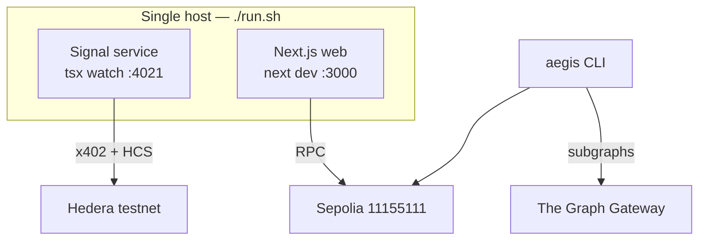
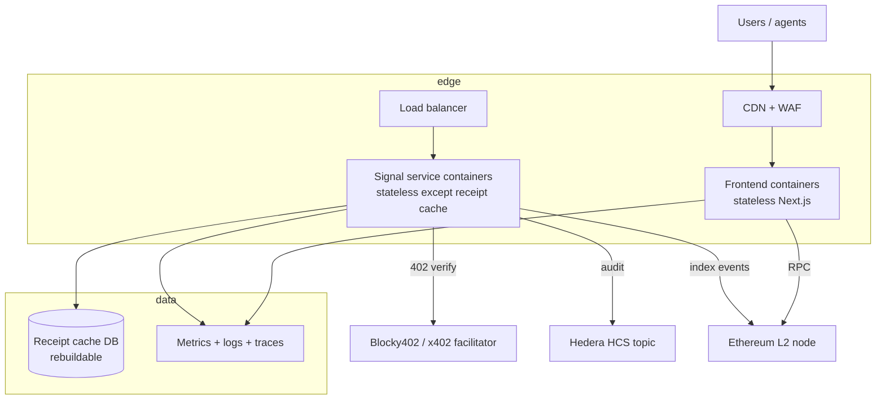

# 04 · Infrastructure & Operations — varanasi

Author: Ramprasad · 2026-09-11

## 1. Current topology (hackathon scale, fully real)

- One command boots both: `./run.sh` (service health-gated on
  `GET /health`, then web). `./run.sh agent` runs the full agent loop once.
- Config via gitignored `.env` per package (`service/`, `agent/`,
  `frontend/.env.local`). Encrypted at rest as `.env.enc`
  (AES-256-CBC + PBKDF2), mode 600, never committed; gitleaks gates CI.
- CI (GitHub Actions, `.github/workflows/ci.yml`): 5 jobs — contracts
  (forge build+test, submodules recursive), agent (typecheck + vitest),
  service (typecheck + build), frontend (typecheck + next build, **with zero
  NEXT_PUBLIC keys**), secrets (gitleaks, full history). All green on main.
- Dependabot for dependency drift.

Deliberate constraint honored by CI: **every job runs from a clean checkout
with zero secrets** — fork tests self-skip without `SEPOLIA_RPC_URL`, agent
tests mock fetch, frontend degrades to setup notices. CI proves the product
builds for anyone who clones.

## 2. Environment strategy

| Env | Purpose | Contracts | Service | Frontend |
|---|---|---|---|---|
| `local` | Development | Sepolia (public testnet) | `:4021` tsx watch | `:3000` next dev |
| `staging` | Pre-release verification | Sepolia (fresh deployment per release candidate) | Containerized, testnet keys | Preview deploy, Privy staging app |
| `production` | Live | Mainnet (post-audit, see gates) | Containerized, mainnet keys, HCS mainnet topic | Production deploy |

Promotion rule: nothing reaches the next environment without the full CI
matrix green **plus** the tier gates in `05-testing-strategy.md`.

## 3. Deployment architecture (target, P1)

Principles: stateless app tier (cache is rebuildable from chain/mirror);
keys held in a managed secret store, never in images; blue/green deploys with
health-gated cutover; contracts are immutable — "deploying" them means a new
audited deployment + address rotation documented exactly like the v2 testnet
redeploy (see `docs/SECURITY_REVIEW.md`).

## 4. Observability

Today: `/health` endpoint (service), structured logs to `/tmp/varanasi-*.log`,
CI as the integration canary, mirror-node receipts as the durable trail.

Target SLOs (staging first):
- Signal service availability: 99.9% monthly (it is *not* in the money path —
  see `03-security-architecture.md` — so this is a product SLO, not a fund
  safety SLO).
- P95 paid-signal latency (402 → payload): < 2.5s (dominated by payment
  verification + settlement).
- Frontend TTI p75 < 2s on the marketplace routes.

Signals to alarm on: 402 verification failures spike, HCS write failures,
RPC error rate, identity revocation events (user-impacting), threshold-change
events (admin action), escrow anomaly (release without preceding validation
event → paging).

## 5. Disaster recovery

| Failure | Impact | Recovery |
|---|---|---|
| Signal service down | No paid signals; UI receipts stale | Settlement unaffected (permissionless); restart container; receipts rebuild from mirror node |
| Frontend down | No marketplace | CLI + direct contract interaction still work |
| Receipt cache lost | UI listing empty until rebuild | Replay Tier 0/1 (events + mirror) |
| RPC provider down | Reads/writes fail for clients | Multi-provider fallback (public RPC fallback exists today in frontend config) |
| Hedera facilitator down | Paid signals blocked | Swap facilitator or serve degraded free tier; HCS topic history unaffected |
| Company disappears | Product support ends | Contracts + ENS names + HCS audit survive; users settle/refund onchain; MIT-licensed code is forkable |

RPO/RPO stance: operating caches are RPO ≈ 0 (rebuildable); there is no
company-held data whose loss loses money. The chain is the backup.

## 6. Capacity & scaling notes

- Current scale: single host, dev processes. Bottleneck order when load
  arrives: (1) receipt cache file → Postgres; (2) single service container →
  horizontal (stateless); (3) subgraph query rate → gateway caching layer;
  (4) escrow throughput → L2 settlement target (see
  `company/05-product-strategy.md` for chain selection criteria).
- Load test gate before production: 100 RPS mixed free/paid on signal service
  with zero 5xx; escrow soak test on staging fork.
